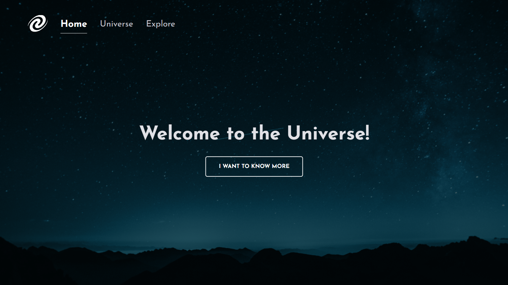

# SPA Universe 🌌 
  

 SPA Universe is a single-page application built using HTML, CSS, and JavaScript. Its primary purpose is to provide a platform for studying the inner workings of single-page applications.

The application incorporates advanced features of HTML, CSS, and JavaScript, ensuring a user-friendly experience with a simple and intuitive interface. The code is well-organized and easy to read, making it an excellent resource for individuals new to programming.

Overall, SPA Universe serves as a valuable tool for those interested in learning about the functionality of single-page applications. It offers a well-designed and intuitive experience, providing a comprehensive introduction to various aspects of this type of application development. 

#
<h2> <strong>What was covered in this challenge:</strong>  </h2>

- SPA concepts;
- Route mapping;
- Asynchrony & promises;
- Clean Code;
- Local Server;
- Objects & Classes;
- Object-oriented programming.
#

#### <h3 align="center">**This project was developed with** </strong></h3>

#### <h3 align="center">HTML | CSS | JavaScript | Node.js | Figma | Git | GitHub </h3>

#

- [Explore the Universe! click here](https://spa-universe-explore.vercel.app/)

#
  
#### 
[Access my profile on LinkedIn here](https://www.linkedin.com/in/ana-paula-bertuol/) 
